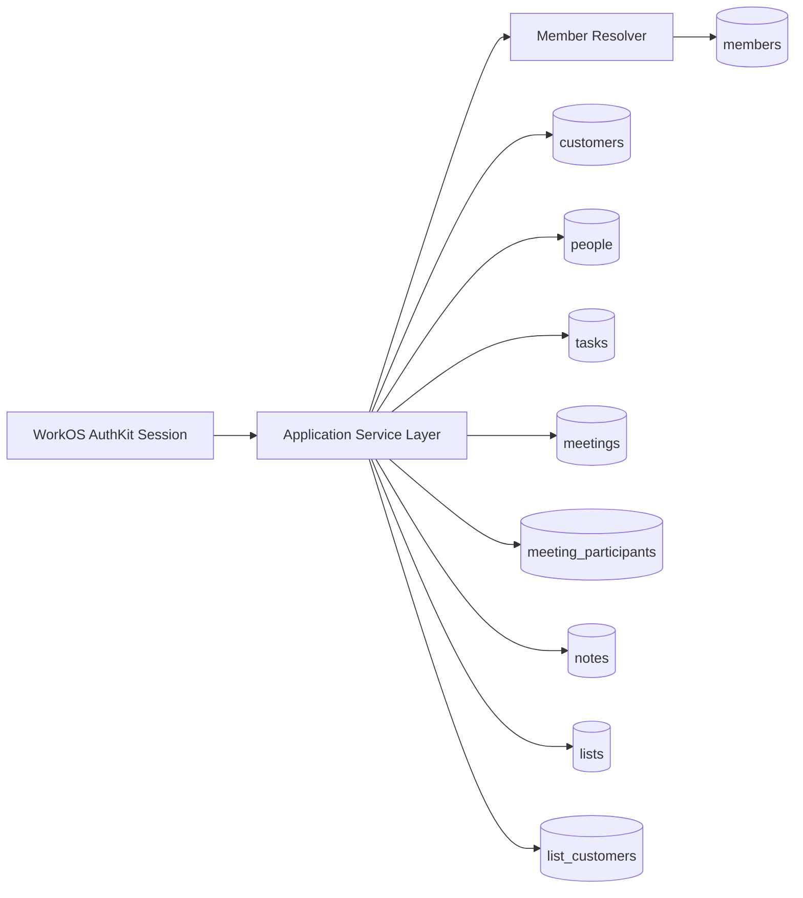
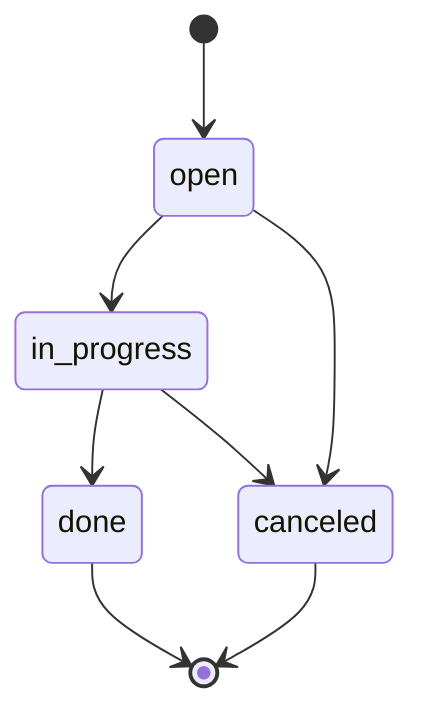
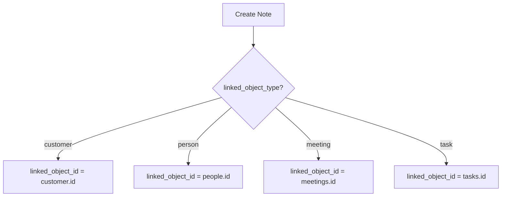

# PEAA-2: Data Model, Migrations, Seed (Locked Execution Plan)

## Scope Lock

This plan covers only PEAA V1 persistence foundations:

- relational data model for V1 objects
- migration ordering and rollback strategy
- seed dataset design for realistic CSM workflows
- validation matrix for schema and seed correctness

Out of scope for this issue:

- API routes and server actions
- UI pages/components
- advanced role-based authorization enforcement
- integrations (calendar, CRM, Slack)

## Technical Decisions

- Database: PostgreSQL 16+
- ID type: `UUID` (`gen_random_uuid()`)
- Time semantics: `TIMESTAMPTZ` in UTC
- Org scoping: every product table includes `organization_id`
- FK behavior: `ON DELETE CASCADE` where child rows are owned by parent object; `ON DELETE SET NULL` where historical record should survive member removal
- Soft delete: not in V1; use hard deletes with FK constraints

Assumption made explicit: V1 is single-region and does not require sharding or cross-region replication at launch.

## Component Boundaries

Boundary rules:

- Auth identity is external (`workos_user_id`) and mapped into local `members`.
- No table is readable/writable without `organization_id` predicate in application queries.
- Join tables (`meeting_participants`, `list_customers`) are write-only through service methods, not raw client updates.

## Relational Model

Primary entities:

- `members`
- `customers`
- `people`
- `tasks`
- `meetings`
- `notes`
- `lists`

Association entities:

- `meeting_participants` (`meeting_id`, `person_id`)
- `list_customers` (`list_id`, `customer_id`)

### Enum Domains

- `member_role`: `admin | manager | csm | am | viewer`
- `customer_lifecycle_stage`: `onboarding | active | renewal | at_risk | churned`
- `record_status`: `active | inactive`
- `person_role`: `champion | admin | executive_sponsor | buyer | end_user | blocker | unknown`
- `relationship_status`: `strong | neutral | weak | unknown`
- `task_status`: `open | in_progress | done | canceled`
- `task_priority`: `low | medium | high`
- `note_linked_object_type`: `customer | person | meeting | task`
- `list_object_type`: `customer`

## Migration Plan

1. `0001_init_schema.sql`
- enable `pgcrypto`
- create enum types
- create base tables with PK/FK/check constraints

2. `0002_indexes.sql`
- add org + sort/filter indexes for primary read paths
- add uniqueness constraints (org + email, org + list name)
- add partial index for open tasks

3. `0003_seed_v1.sql`
- deterministic seed members/customers/people/tasks/meetings/notes/lists
- include overdue, due-today, and done tasks
- include customer list memberships that mirror Today workflows

Rollback policy:

- Development: drop and recreate DB when rolling back across enum shape changes.
- Production: forward-only migrations; corrective migrations instead of down migrations.

## Data Flow and State Transitions

### Task State Model

Rules:

- `completed_at` is required when state becomes `done`.
- `completed_at` must be `NULL` for non-`done` states.

### Note Link Validation

V1 enforcement strategy:

- FK to `customer_id` always required.
- `linked_object_type` + `linked_object_id` validated in service layer (cross-table polymorphic link).

## Failure Modes and Edge Cases

- Cross-org data leakage
  - Mitigation: composite indexes on `(organization_id, ...)`; service queries must predicate by org.
- Member deletion while owning records
  - Mitigation: owner FKs use `ON DELETE SET NULL` to preserve historical task/note/customer ownership context.
- Duplicate person emails inside one org
  - Mitigation: unique `(organization_id, email)` where `email IS NOT NULL`.
- Duplicate list names in an org
  - Mitigation: unique `(organization_id, lower(name))`.
- Invalid note links
  - Mitigation: service-level lookup and validation before insert/update.

## Test Matrix (PEAA-2)

1. Migration tests
- apply migrations on empty DB
- assert all tables/enums/indexes exist
- rerun migrations is idempotent where expected

2. Constraint tests
- cannot insert child row with mismatched org references
- cannot duplicate `(organization_id, email)` for `people`
- cannot set `completed_at` when task not `done`

3. Seed tests
- seed inserts 8-12 customers, 20-40 people, 30-50 tasks, 12-20 meetings, 30-50 notes, 4-6 lists, 3-5 members
- at least one overdue task, one due-today task, one done task
- each customer has at least one linked record in people/tasks/notes

4. Query-path tests
- today query can fetch overdue + due today tasks by org
- customer detail query can fetch joined people/tasks/meetings/notes/lists by customer + org

## Assignment Handoff

- Staff Engineer
  - integrate SQL files into chosen migration runner (`drizzle-kit`, `prisma migrate`, or `node-pg-migrate`) in target app repo
  - implement repository/service-level org predicates and note link validation
- QA Engineer
  - execute migration + seed matrix in ephemeral DB
  - validate Today and Customer detail read-path prerequisites
- Release Engineer
  - define migration runbook for staging/prod with backup + forward-fix policy

## Immediate Next Action

- Implement SQL artifacts now in this workspace as canonical reference:
  - `docs/superpowers/engineering/sql/0001_init_schema.sql`
  - `docs/superpowers/engineering/sql/0002_indexes.sql`
  - `docs/superpowers/engineering/sql/0003_seed_v1.sql`
- Apply and verify in Postgres using:
  - `docs/superpowers/engineering/sql/README.md`
  - `docs/superpowers/engineering/sql/verify_v1_read_paths.sql`
  - `docs/superpowers/engineering/sql/verify_v1_assertions.sql`

## Execution Evidence

- Applied successfully in local PostgreSQL 16 database `peaa2_dev`:
  - `0001_init_schema.sql`
  - `0002_indexes.sql`
  - `0003_seed_v1.sql`
- Read-path verification executed:
  - `verify_v1_read_paths.sql` returned expected counts and customer-detail graph rows.
- Assertion verification executed:
  - `verify_v1_assertions.sql` completed with notice: `PEAA-2 assertions passed: schema + seed support Today and customer-detail read paths.`
- CI-oriented suite runner validated:
  - `docs/superpowers/engineering/scripts/run_peaa2_sql_suite.sh`
  - completed successfully against fresh `peaa2_ci` database.
- Defect discovered and fixed during execution:
  - Seed initially failed note-link trigger when inactive customer had no meeting row.
  - Resolved by seeding meetings for all customers (meeting count now 16, still within V1 target range 12-20).
- Handoff report:
  - `docs/superpowers/engineering/peaa-2-handoff-report.md`
- Definition-of-done checklist:
  - `docs/superpowers/engineering/peaa-2-definition-of-done.md`
