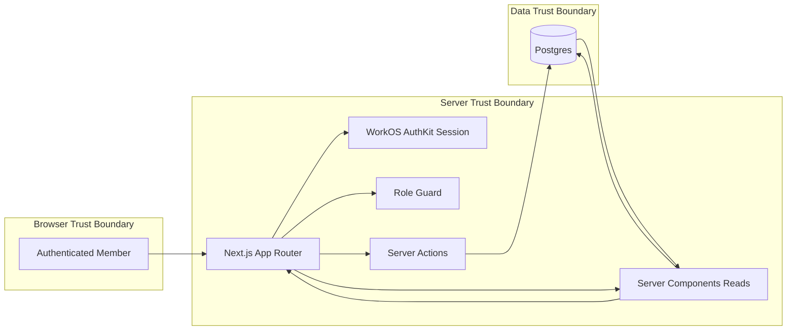
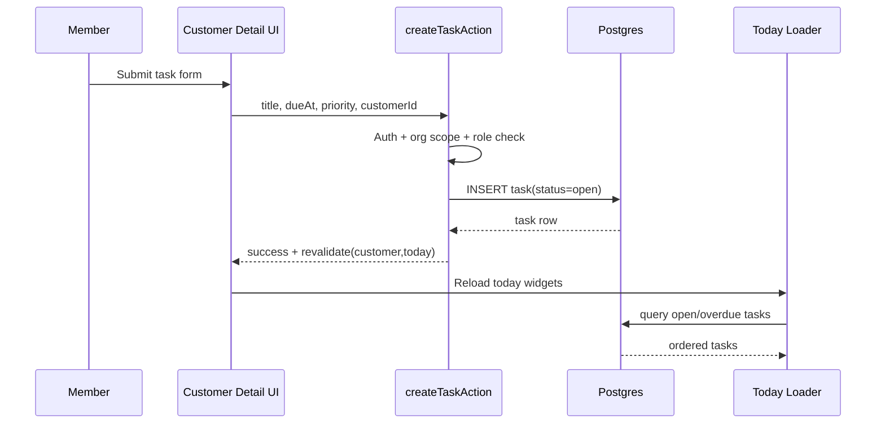
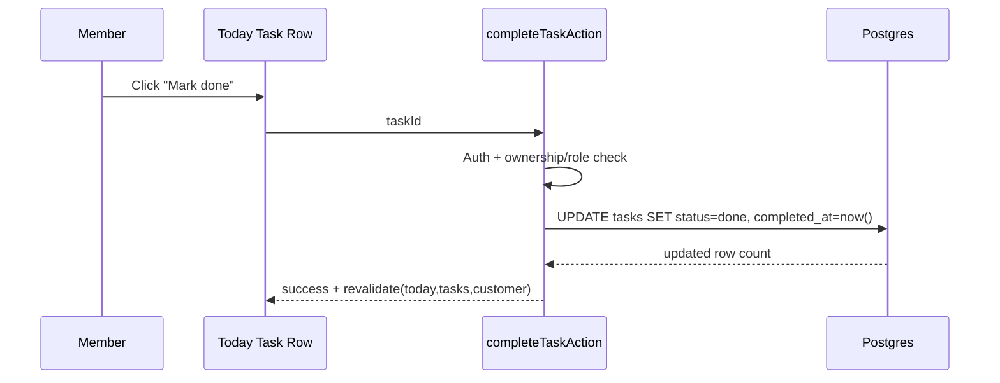
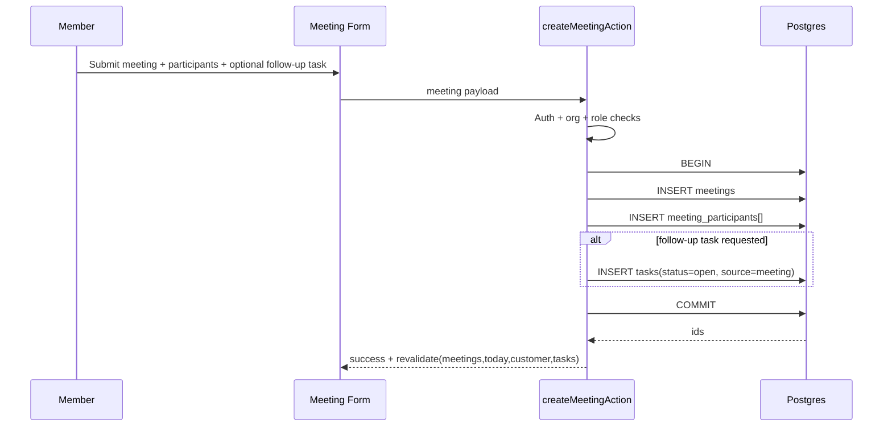

# PEAA-5 Technical Execution Plan

## Issue

- Parent: `PEAA-1.4`
- Scope: `Execution Flows (Tasks, Meetings, Notes, Lists, Today, QA)`
- Date: `2026-04-27`
- Owner: CTO (Eng Manager mode)
- Status: Locked for implementation

## 1. Scope Lock

In-scope surfaces:

- `Today` dashboard data aggregation and task execution.
- `Tasks` CRUD + status transitions.
- `Meetings` CRUD + participant links + optional task creation.
- `Notes` CRUD (always customer-linked; optional object links).
- `Lists` CRUD metadata + customer membership add/remove.
- End-to-end QA matrix for all execution flows.

Out-of-scope:

- Any AI prioritization or summarization.
- Calendar sync, email sync, Slack sync, workflow automation.
- Dynamic segment/list rules.

## 2. Architecture and System Boundaries

Boundary rules:

- Browser never writes directly to DB.
- All mutations go through typed server actions.
- Every read/write query is hard-scoped by `organization_id`.
- Role authorization is applied inside server actions and list/detail loaders.
- No cross-tenant identifiers are trusted from client input.

## 3. Domain Model Constraints (Execution Objects)

Core required constraints:

- `tasks.customer_id` is required and FK to `customers.id`.
- `meetings.customer_id` is required and FK to `customers.id`.
- `notes.customer_id` is required and FK to `customers.id`.
- `meeting_participants` uniqueness: `(meeting_id, person_id)`.
- `list_customers` uniqueness: `(list_id, customer_id)`.
- `notes.linked_object_type` in `{customer, person, meeting, task}` when set.
- `notes.linked_object_id` required when `linked_object_type` is set.
- Soft invariant: linked object must belong to same `organization_id` and same `customer_id` where applicable.

Task state enum lock:

- `open -> in_progress -> done`
- `open -> canceled`
- `in_progress -> canceled`
- `done` is terminal unless explicit reopen action is added later.

## 4. Sequence Flows

### 4.1 Create Task from Customer Detail

### 4.2 Complete Task from Today

### 4.3 Log Meeting and Attach Follow-up Task

## 5. Today Page Data Flow and Ordering

Deterministic loading pipeline:

1. Resolve `member_id`, `organization_id`, role from session.
2. Load "My tasks" where `owner_member_id = member_id` and `status in (open, in_progress)`.
3. Split tasks into overdue (`due_at < now`) and due today (`date(due_at)=today`).
4. Load upcoming meetings (`scheduled_at >= now`) ordered ascending.
5. Load recently updated customers ordered by `updated_at desc`.
6. Load lists created by member + lists containing member-owned customers.

Ordering lock:

- Tasks: overdue first, then due today, then no due date.
- Meetings: soonest first.
- Customers: newest updates first.
- Lists: explicit `updated_at desc`.

## 6. Failure Modes and Mitigations

| Failure mode | Detection point | Handling | User-visible behavior |
|---|---|---|---|
| Cross-org ID passed in form | Server action pre-query | Reject with 404/forbidden | Generic "not found or no access" |
| Concurrent update on same task | `updated_at` optimistic check | Return conflict | "Task changed, refresh required" |
| Duplicate participant add | DB unique constraint | Ignore or return idempotent success | No duplicate row shown |
| Meeting + participants partial write | Transaction | Rollback all | No partially created meeting |
| Invalid linked note object | Validation + FK lookup | Reject bad request | Inline form error |
| Stale Today list after mutation | Missing revalidate tags | Enforce tag policy in every action | Updated widgets after action |

## 7. Trust and Authorization Model

Authorization matrix:

- `admin`, `manager`: full CRUD across org.
- `csm`, `am`: CRUD on assigned customers and own tasks/notes/meetings unless customer-level ownership allows broader access.
- `viewer`: read-only across org.

Enforcement points:

- Central `requireMemberContext()` guard returns `{memberId, organizationId, role}`.
- Every loader/action accepts context; never accepts `organizationId` from client.
- Object-level checks verify object belongs to same org before mutate/delete.

## 8. Test Coverage Matrix (Locked)

### 8.1 Unit

- Task transition validator permits only allowed state graph.
- Today sorting helper returns deterministic order for overdue/today/undated tasks.
- Note link validator enforces `(linked_object_type, linked_object_id)` pair semantics.

### 8.2 Integration (DB + Server Actions)

- Create/update/delete task scoped by org.
- Complete task sets `completed_at`.
- Meeting creation is transactional with participants and optional task.
- List membership add/remove enforces uniqueness and same-org customer.
- Note create rejects cross-org linked object.

### 8.3 E2E (Playwright)

- Sign in -> Today renders correct sections.
- Create task in customer detail -> appears in Today and Tasks.
- Complete task in Today -> removed from open widgets and visible in done filter.
- Create meeting with participants -> appears in Meetings and customer timeline.
- Create note linked to meeting -> visible in Notes and customer detail context.
- Add customer to list -> visible in Lists and customer list membership badges.

### 8.4 Regression / Edge

- Timezone boundary around midnight for overdue vs due today logic.
- Deleted customer cascades or blocks dependent objects per FK strategy.
- Viewer cannot trigger server mutations.

## 9. Implementation Breakdown and Ownership

### Staff Engineer (primary implementer, review gate owner)

- Build server action layer + query loaders for Tasks, Meetings, Notes, Lists, Today.
- Implement role guard and org-scope enforcement wrappers.
- Add revalidation tag strategy and transaction wrappers.

### QA Engineer

- Convert test matrix into executable E2E checklist.
- Validate deterministic ordering and permission denial cases.
- Run smoke tests on seeded data with multiple member roles.

### Release Engineer

- Verify migration order and rollback plan for execution-flow tables/constraints.
- Validate environment config for WorkOS + DB in staging.
- Gate release on test matrix pass + migration health.

## 10. Handoff Contract

1. Staff Engineer implements by vertical slices in this order:
   - Tasks + Today
   - Meetings
   - Notes
   - Lists
2. QA Engineer executes matrix on each slice before next slice starts.
3. Branch ready state is routed to Staff Engineer for final review sign-off.
4. Release Engineer handles promotion after QA pass and sign-off.

## 11. Definition of Done

- All in-scope flows implemented with server-side authz and org isolation.
- Deterministic Today ordering confirmed by automated tests.
- No partial writes for multi-entity mutations (transactional guarantee).
- E2E matrix green for admin/csm/viewer role paths.
- No AI/workflow/integration surfaces introduced in this issue.
